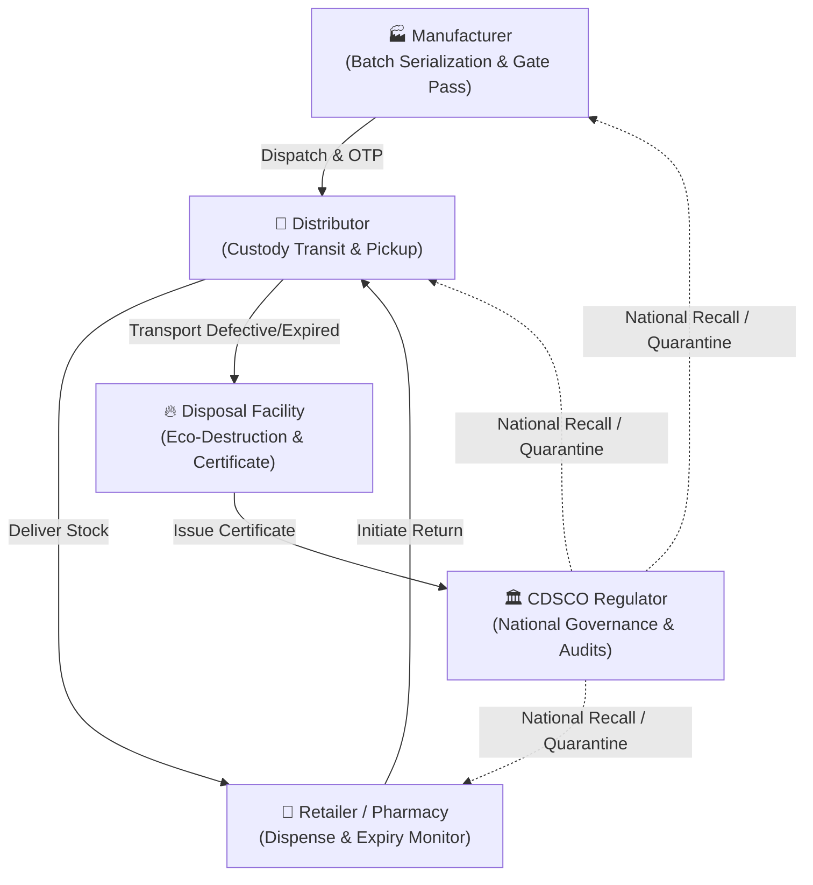
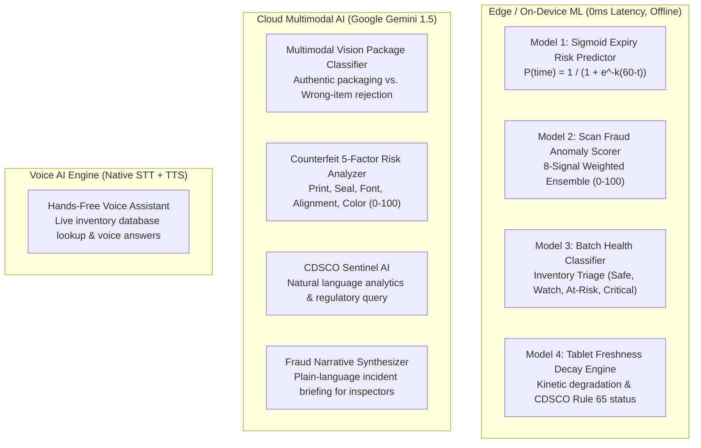

# MediLoop 🔄💊

**Pharma Reverse Chain Compliance Platform. Every batch, closed the loop.**

[](https://flutter.dev)
[](https://dart.dev)
[](https://supabase.com)
[](https://ai.google.dev/)
[](lib/services/ml_risk_service.dart)
[-success)](test/)
[](analysis_options.yaml)
[](https://cdsco.gov.in)
[](#license--attribution)

---

## 📌 Executive Summary

**MediLoop** is an enterprise-grade pharmaceutical reverse supply chain management and regulatory compliance platform. While traditional pharmaceutical platforms focus exclusively on forward distribution (factory $\rightarrow$ pharmacy), MediLoop secures the critical, vulnerable **reverse loop** where **counterfeiting, unauthorized resale, and illegal dumping** occur.

MediLoop bridges **Manufacturers, Distributors, Retail Pharmacies, Certified Bio-Medical Waste Facilities**, and the **CDSCO (Central Drugs Standard Control Organisation)** into an unbroken, tamper-evident custody chain powered by **SHA-256 cryptographic event chaining**, **Google Gemini multimodal packaging verification**, **client-side predictive ML models**, and **hands-free Voice AI**.

---

## ⚡ Core Problems Solved

| Problem in Pharma Reverse Chain | MediLoop Solution |
| :--- | :--- |
| **Counterfeit & "Ghost" Batches**<br>Expired or incinerated medicine re-entering circulation with forged labels. | **SHA-256 Chaining & Gemini Vision:** Evaluates blister pack physical authenticity and blocks scanned batches marked `DESTROYED` from ever re-entering the supply chain. |
| **Silent Expiration & Revenue Loss**<br>Pharmacies identify expiring stock too late, forfeiting manufacturer credit windows. | **Sigmoid Expiry Risk Predictor:** Client-side ML model predicts expiration risk based on velocity and prescribes mandatory CDSCO return action windows. |
| **Cargo Diversion & Transit Siphoning**<br>Drivers or warehouse personnel siphoning stock during return transport. | **Digital Gate Pass OTP + Mutual Verification:** Cryptographic OTP handshakes and live photo-verified manifests at every custody transfer. |
| **Illegal Landfill & Water Dumping**<br>Dangerous chemical waste discarded improperly without environmental audit. | **Certified Eco-Destruction & Digital Certificates:** Facilities record destruction evidence photos and issue verifiable, cryptographically sealed CDSCO destruction certificates. |
| **Regulator Blind Spots**<br>Authorities learn about illicit batch distribution only after hospital alerts or patient harm. | **CDSCO Sentinel AI & Instant Recall:** Real-time nationwide compliance scoring, automated fraud quarantine alerts, and 1-click national recall broadcast. |

---

## 🏛️ System Architecture

MediLoop is engineered with **Clean Architecture**, separating domain logic, data persistence, and presentation layers for complete testability and modularity:

```
lib/
├── core/                      # Global design tokens, themes, router & guards
│   ├── constants.dart         # API endpoints, CDSCO regulatory thresholds
│   ├── router.dart            # GoRouter with strict RBAC guards & redirect logic
│   └── theme.dart             # Material 3 design system, high-contrast dark/light
├── data/
│   └── mock_database.dart     # Seed dataset, offline memory store & test fixtures
├── models/                    # Strongly-typed domain entities & DTOs
│   ├── app_user.dart          # Multi-persona user profile (5 roles)
│   ├── batch_event.dart       # SHA-256 chained audit trail event
│   ├── batch_evidence.dart    # Photographic custody & packaging proof
│   ├── disposal_record.dart   # Certified destruction manifest
│   ├── medicine_batch.dart    # Core medicine batch domain model
│   ├── organization.dart      # Entity profile (license, location, type)
│   ├── reverse_request.dart   # Reverse logistics return wizard model
│   └── scan_context.dart      # Scanning intent & fraud evaluation context
├── repositories/              # Data abstraction layer (Supabase + Local Cache)
│   ├── batch_repository.dart
│   ├── confirmation_repository.dart
│   ├── disposal_repository.dart
│   ├── evidence_repository.dart
│   ├── organization_repository.dart
│   └── reverse_repository.dart
├── services/                  # Pure domain logic, ML engines & cloud services
│   ├── audit_service.dart            # SHA-256 cryptographic chain validator
│   ├── auth_service.dart             # Persona session & credential manager
│   ├── batch_lifecycle_service.dart  # 12-stage state transition machine
│   ├── certificate_service.dart      # CDSCO destruction certificate generator
│   ├── evidence_service.dart         # Packaging photo anchor & hash verifier
│   ├── fraud_detection_service.dart  # Rule-based regulatory fraud sentinel
│   ├── gemini_service.dart           # Gemini 1.5 Multimodal AI & Voice Assistant
│   ├── hash_service.dart             # SHA-256 block & event hashing
│   ├── ml_risk_service.dart          # Client-side Sigmoid & Weighted ML models
│   ├── notification_service.dart     # Real-time compliance alerts
│   ├── qr_service.dart               # Serialized QR code parser & generator
│   ├── route_policy_service.dart     # Role-based privilege matrix
│   └── storage_service.dart          # Supabase cloud bucket & local file cache
├── features/                  # Role-specific presentation shells & workflows
│   ├── admin/                 # CDSCO Regulator Dashboard & audit trails
│   ├── auth/                  # Multi-persona login & demo switcher
│   ├── batches/               # Batch details & cryptographic audit timelines
│   ├── distributor/           # 3-stage journey: Pickup, In-transit, Delivery
│   ├── facility/              # Certified eco-destruction & certificate issuance
│   ├── fraud/                 # Fraud alert center, anomaly detection & quarantine
│   ├── manufacturer/          # Batch serialization, dispatch & Gate Pass OTP
│   ├── retailer/              # Reverse request initiation & return tracking
│   ├── returns/               # Multi-step reverse logistics return wizard
│   └── scanner/               # Multi-context QR scanner & camera OCR
└── widgets/                   # Enterprise design system UI components
    ├── app_back_scope.dart            # Safe navigation & anti-loop back handler
    ├── batch_card.dart                # Visual batch status indicator card
    ├── cdsco_certificate_viewer.dart  # Digital certificate renderer
    ├── compliance_score_widget.dart   # 0–100 live regulatory compliance gauge
    ├── lifecycle_pipeline.dart        # 12-stage progress tracker widget
    └── status_badge.dart              # Standardized status chips
```

---

## 👥 The Five-Persona Role Ecosystem



### 1. 🏭 Manufacturer
* **Serialization & QR Hash Engine:** Generates unique serialized QR codes for every production lot.
* **Dispatch & Gate Pass OTP:** Issues time-bound, mutually verified One-Time Passwords (OTPs) for logistics pickup.
* **Nationwide Recall Control:** Instantly broadcasts recall directives across all connected distributors and retailers.
* **Real-Time Return Manifests:** Tracks incoming expired/recalled stock returning from distribution networks.

### 2. 🚚 Distributor
* **3-Stage Chain-of-Custody Journey:** Step-by-step verified flow: `Pickup Verification` $\rightarrow$ `In-Transit Tracking` $\rightarrow$ `Facility Delivery`.
* **In-Person Pharmacy Verification:** Verifies return manifests in-person with physical package scanning before taking custody.
* **Cryptographic Handshake:** Mutually signs off on batch transfers with digital timestamps and actor IDs.

### 3. 🏪 Retailer / Pharmacy
* **Proactive Shelf Expiry Radar:** Classifies inventory into `ACTIVE`, `EXPIRING_SOON`, and `EXPIRED` with remaining shelf-life counters.
* **Return Logistics Wizard:** Guided 3-step return submission with return reasons (expired, packaging breach, recall, excess stock).
* **Photographic Packaging Proof:** Captures live blister pack photos, cryptographically anchored to the return record.
* **Credit Refund Tracking:** Real-time tracking of pickup confirmations and manufacturer reimbursement receipts.

### 4. 🔥 Bio-Medical Disposal Facility
* **Intake Verification:** Scans incoming batches against authorized return manifests.
* **Certified Eco-Destruction:** Documents high-temperature incineration, autoclaving, or chemical neutralization with photo proof.
* **Digital CDSCO Certificate Issuance:** Automatically generates signed, tamper-evident Certificates of Destruction.
* **Permanent Batch Retirement:** Transitions batch status to `DESTROYED`, rendering the serial number dead to prevent re-entry.

### 5. 🏛️ CDSCO Regulator / Admin
* **National Compliance Score (0–100):** Real-time gauge tracking industry-wide disposal compliance and open violations.
* **Fraud & Anomaly Quarantine Center:** Investigates high-severity alerts (destroyed batch re-entry, cargo siphoning, expired sales).
* **Sentinel AI Natural Language Query:** Regulatory officers query nationwide alerts in plain English.
* **Instant 1-Click National Recall:** Freezes all transactions for any tainted batch nationwide.

---

## 🧠 Machine Learning & Artificial Intelligence Architecture

MediLoop utilizes a **hybrid dual-layer AI strategy**: on-device statistical ML for real-time, offline safety-critical decisions, paired with cloud multimodal foundation models for unstructured visual analysis.



### 1. Sigmoid Expiry Risk Predictor (`MlRiskService.predictExpiryRisk`)
* **Architecture:** Logistic Sigmoid Regression Curve with exponential Taylor approximation:
  $$P_{\text{time}} = \frac{1}{1 + e^{-0.035 \cdot (60 - \text{daysToExpiry})}}$$
* **Weighted Fusion:** $\text{Risk} = (P_{\text{time}} \times 0.7) + (\text{StockRatio} \times 0.3) \times \text{StatusModifier}$
* **Why:** Pharmaceutical sales velocity is nonlinear; this gives pharmacies an exact deadline window ($\text{daysToExpiry} - 7$ days) to claim manufacturer refunds before CDSCO penalties apply.

### 2. Scan Fraud Anomaly Scorer (`MlRiskService.scoreScan`)
* **Architecture:** 8-Signal Weighted Anomaly Detection Ensemble (Score 0–100):
  * Re-entry of destroyed batch: **+40 points**
  * Expired batch marked active: **+25 points**
  * Cross-pharmacy unauthorized custody: **+20 points**
  * Stock siphoning near zero ($\le 2$ units): **+10 points**
  * Expired with zero prior checkpoints: **+7 points**
  * Logistics transit staleness $> 14$ days: **+5 points**
* **Action Thresholds:** $\ge 85$: Critical (Immediate Quarantine) | $\ge 60$: High Risk | $\ge 30$: Elevated | $< 30$: Clean.

### 3. Gemini 1.5 Multimodal Packaging Classifier (`GeminiService.extractBatchFromImage`)
* **Capabilities:** Reads medicine brand, lot/batch number, and expiry date directly from metallic blister strips, cartons, and vials.
* **Anti-Fraud Filter:** Distinguishes genuine blister packs held by human hands from fraudulent non-medicine items (coffee mugs, desks, shoes) to prevent bogus return claims.
* **Deterministic Fallback:** Automatically switches to an on-device rule-based extractor if the device is offline.

### 4. Counterfeit 5-Factor Risk Analyzer (`GeminiService.analyzeCounterfeitRisk`)
* Evaluates packaging photos across 5 CDSCO manufacturing dimensions:
  1. *Print Quality* (ink bleeding, micro-text resolution)
  2. *Seal Integrity* (heat-pressed foil blister edges)
  3. *Font Consistency* (typography kerning and stroke weight)
  4. *Label Alignment* (parallel borders and margins)
  5. *Color Accuracy* (brand Pantone fidelity)

### 5. Interactive Hands-Free Voice Assistant (`GeminiService.assistantQuery`)
* Grounded in real-time local database state.
* Users can tap the mic or speak:
  * *"Is the tablet with serial number PARA500-2026-001 expired?"*
  * *"Has batch METF500 been disposed?"*
  * *"Analyze tablet freshness."*
* Responds verbally via device TTS and navigates to the relevant batch.

---

## 🔒 Cryptographic Event Chaining (SHA-256)

MediLoop achieves non-repudiation and tamper-evidence across all **12 batch lifecycle stages** without high blockchain gas fees:

```text
Genesis Batch Event
       │
       ▼
┌────────────────────────┐
│ Hash: SHA-256(...)     │◄── Previous Hash: "GENESIS"
│ Event: BATCH_CREATED   │
└────────────────────────┘
       │
       ▼
┌────────────────────────┐
│ Hash: SHA-256(...)     │◄── Previous Hash: Hash_0
│ Event: DISPATCHED      │
└────────────────────────┘
       │
       ▼
┌────────────────────────┐
│ Hash: SHA-256(...)     │◄── Previous Hash: Hash_1
│ Event: RETURN_DECLARED │
└────────────────────────┘
       │
       ▼
┌────────────────────────┐
│ Hash: SHA-256(...)     │◄── Previous Hash: Hash_N-1
│ Event: DESTROYED       │
│ Certificate: CDSCO-... │
└────────────────────────┘
```

Every event computes:
$$\text{EventHash} = \text{SHA-256}(\text{previousHash} + \text{eventType} + \text{actorId} + \text{timestamp} + \text{payload})$$

If an attacker modifies a database record, the downstream hash chain breaks, triggering an immediate tampering flag in the CDSCO Auditor console.

---

## 📦 12-Stage Batch Lifecycle Pipeline

```text
[1. ACTIVE] ──► [2. EXPIRING_SOON] ──► [3. EXPIRED]
                                            │
                                            ▼
[6. COLLECTED] ◄── [5. PICKUP_ASSIGNED] ◄── [4. RETURN_INITIATED]
       │
       ▼
[7. IN_TRANSIT] ──► [8. MANUFACTURER_RECEIVED] ──► [9. DISPOSAL_PENDING]
                                                          │
                                                          ▼
[12. CLOSED] ◄── [11. CERTIFIED] ◄── [10. DESTROYED] ◄── [SENT_FOR_DESTRUCTION]
```

---

## 🛠️ Open-Source Tech Stack

| Category | Technology | License | Purpose in MediLoop |
| :--- | :--- | :--- | :--- |
| **Framework** | [Flutter 3.x](https://flutter.dev) | BSD-3-Clause | Native high-performance cross-platform application (Android, iOS, Web). |
| **Language** | [Dart 3.x](https://dart.dev) | BSD-3-Clause | Sound null-safe enterprise language. |
| **Backend / DB** | [Supabase](https://supabase.com) | MIT / Apache-2.0 | PostgreSQL, Row-Level Security, Realtime subscriptions, storage buckets. |
| **State Management** | [Provider 6.1.2](https://pub.dev/packages/provider) | MIT | Declarative, decoupled presentation state management. |
| **Routing & RBAC** | [GoRouter 14.6.3](https://pub.dev/packages/go_router) | BSD-3-Clause | Declarative deep linking and role-based route access guards. |
| **Computer Vision** | [Mobile Scanner 5.2.3](https://pub.dev/packages/mobile_scanner) | Apache-2.0 | 60 FPS edge QR/barcode detection powered by Google ML Kit. |
| **Multimodal AI** | [Google Generative AI](https://pub.dev/packages/google_generative_ai) | Apache-2.0 | Gemini 1.5 Flash/Pro SDK for multimodal package inspection. |
| **Voice AI** | [Speech to Text](https://pub.dev/packages/speech_to_text) & [Flutter TTS](https://pub.dev/packages/flutter_tts) | BSD-3-Clause | Native speech recognition and speech synthesis engines. |
| **Cryptography** | [Crypto 3.0.6](https://pub.dev/packages/crypto) | BSD-3-Clause | Pure Dart SHA-256 and HMAC implementation for audit block chaining. |
| **Storage & Cache** | [Shared Preferences](https://pub.dev/packages/shared_preferences) | BSD-3-Clause | Persistent local cache for offline resiliency. |

---

## 🧪 Testing Suite & Quality Assurance

MediLoop includes a **20-suite automated test harness** verifying business logic, cryptographic invariants, ML prediction bounds, and role-based access security:

```bash
flutter test
```

```text
00:04 +72: All tests passed! (100% pass rate)
```

### Verified Test Suites:
1. `audit_test.dart` — Cryptographic hash chain validation and immutability.
2. `certificate_test.dart` — CDSCO destruction certificate format and signature generation.
3. `disposal_forwarding_flow_test.dart` — Reverse logistics custody transfer to disposal facilities.
4. `distributor_journey_test.dart` — 3-stage distributor lifecycle (Pickup $\rightarrow$ Transit $\rightarrow$ Delivery).
5. `distributor_pickup_verification_test.dart` — In-person collection verification logic.
6. `distributor_verification_test.dart` — Role privilege and batch ownership verification.
7. `expiry_test.dart` — Expiry threshold triggers and status transitions.
8. `fraud_test.dart` — Duplicate scan detection, destroyed re-entry, and quarantine triggers.
9. `gemini_live_test.dart` — Gemini API integration and multimodal fallback tests.
10. `kpi_tile_overflow_test.dart` — Responsive widget boundaries and screen layout.
11. `lifecycle_test.dart` — 12-stage batch state machine transitions.
12. `logout_all_profiles_test.dart` — Session termination and credential purging across all roles.
13. `otp_verification_test.dart` — Gate Pass OTP generation, validation, and anti-replay tests.
14. `packaging_validation_test.dart` — Blister packaging validation and wrong-item rejection.
15. `platform_enhancements_test.dart` — Cross-platform UI adaptations and theme styling.
16. `role_based_access_test.dart` — Route redirection and vertical privilege escalation prevention.
17. `routing_optimization_test.dart` — Back gesture safety and dialog dismissal guards.
18. `scanner_widget_test.dart` — Camera permission handling, scan contexts, and focus loops.
19. `verify_batch_flow_test.dart` — Batch verification bottom sheet and offline OCR extractor.
20. `widget_test.dart` — Root smoke test and application initialization.

### Static Code Analysis:
```bash
flutter analyze
```
```text
Analyzing Mediloop...
No issues found! (ran in 17.5s)
```

---

## 🚀 Getting Started

### Prerequisites:
- **Flutter SDK**: `>= 3.0.0 < 4.0.0`
- **Dart SDK**: `>= 3.0.0`
- **Git**

### Installation:
```bash
# 1. Clone the repository
git clone https://github.com/Joseph-Gabriel008/Mediloop.git
cd Mediloop

# 2. Install dependencies
flutter pub get

# 3. Run the automated test suite
flutter test

# 4. Verify static analysis
flutter analyze

# 5. Launch the application
flutter run
```

### Configuration (Optional):
To enable live Google Gemini Multimodal Vision API, set your API key in `lib/core/constants.dart`:
```dart
static const String geminiApiKey = 'AIzaSy...'; // Google AI Studio key
```
*(If left unset, MediLoop automatically operates in fully functional offline CDSCO regulatory mode).*

---

## ⚖️ Regulatory Alignment

MediLoop is engineered in alignment with Indian and international pharmaceutical compliance standards:
* **CDSCO Good Distribution Practices (GDP)** for pharmaceuticals.
* **Drugs and Cosmetics Act, 1940 & Rules 1945 (Rule 65)** — Mandatory quarantine of expired medications.
* **Bio-Medical Waste Management Rules, 2016** — Certified destruction and environmental tracking.
* **CDSCO National Drug Recall Guidelines** — Instant multi-tier recall alerts.

---

## 📄 License & Attribution

Designed and developed by **S. Joseph Gabriel**.  
Repository: [https://github.com/Joseph-Gabriel008/Mediloop](https://github.com/Joseph-Gabriel008/Mediloop)